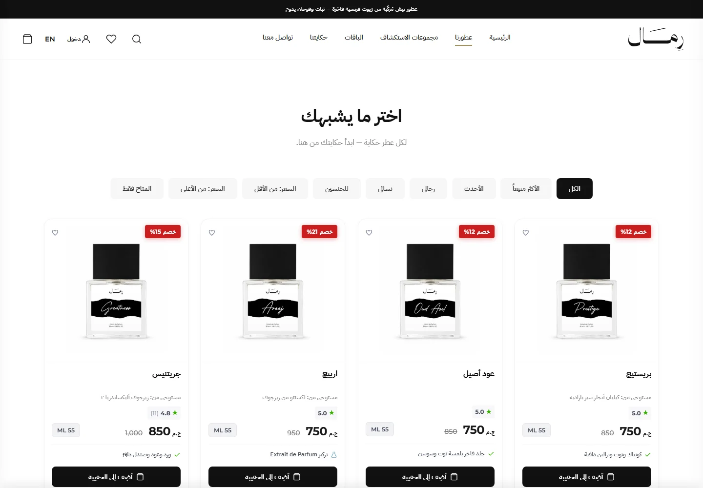
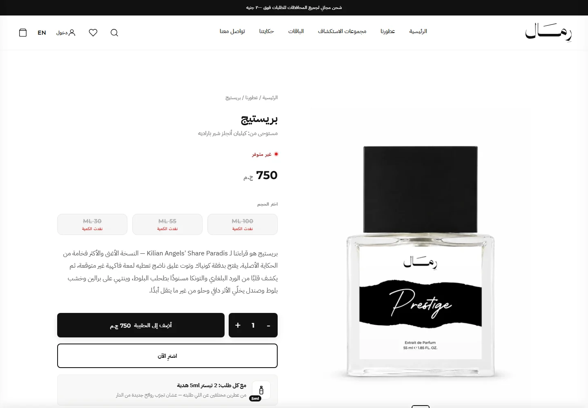
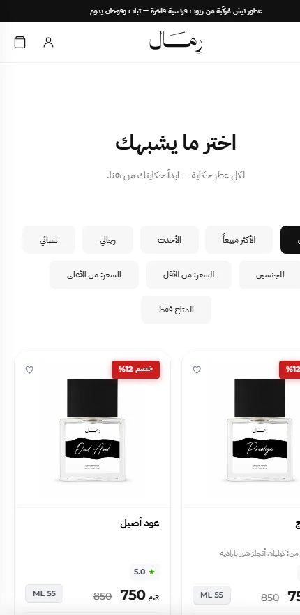

<div align="center">

# Remal

**A production e‑commerce platform for a niche perfume house.**
Bilingual storefront, single‑page checkout, and a 14‑section back office — built solo, running live.

### [→ remalfragrances.com](https://remalfragrances.com)

[](https://remalfragrances.com)


</div>

---

<div align="center">
  
</div>

<table>
<tr>
<td width="50%"></td>
<td width="50%"></td>
</tr>
<tr>
<td align="center"><sub>Catalogue — filters, discounts, ratings, per‑size pricing</sub></td>
<td align="center"><sub>Product — size selection, live stock, bundled gifts</sub></td>
</tr>
</table>

---

## Contents

[Overview](#overview) ·
[Storefront](#storefront) ·
[Back office](#back-office) ·
[Engineering highlights](#engineering-highlights) ·
[Architecture](#architecture) ·
[Tech stack](#tech-stack) ·
[Running it](#running-it) ·
[Project structure](#project-structure) ·
[Security](#configuration--security)

---

## Overview

One .NET solution serving both halves of a real retail business — the shop customers buy
from, and the back office the owner runs the company from. It handles real orders, real
money and real inventory.

| | |
|---|---|
| **Backend** | ~59,600 lines of C# across 4 layers |
| **API** | 100 REST endpoints across 12 controllers |
| **Tests** | 98 passing (xUnit, in‑memory EF Core) |
| **Data** | 19 entities · 21 migrations |
| **Frontend** | 2 single‑page apps, no framework, no build step |
| **Languages** | Arabic (RTL) and English, switchable at runtime |

---

## Storefront

The customer‑facing shop at **[remalfragrances.com](https://remalfragrances.com)**.

**Catalogue** — products carrying multiple sizes at independent prices and stock levels,
curated collections, discovery bundles, sorting and filtering by gender, price, newest and
best‑selling, with live stock state down to the individual size.

**Product pages** — fragrance note pyramid, performance notes (projection, sillage,
longevity), the fragrance each scent is inspired by stated openly, customer reviews with
ratings, and server‑rendered Open Graph tags so shared links unfurl correctly.

**Buying** — cart, wishlist, coupon codes, automatic promotions, a loyalty‑points tier
system that accrues on delivery, shipping priced per governorate, and single‑page checkout
with cash on delivery or Paymob card payment.

**Accounts** — registration with email confirmation, Google sign‑in, password reset, address
book, and full order history.

**Throughout** — complete Arabic/English switching including RTL layout mirroring, a PWA
service worker, and DPR‑aware responsive images.

<div align="center">
  
  <br><sub>Mobile — where the majority of real traffic arrives</sub>
</div>

---

## Back office

A second single‑page application behind role‑based auth (`Admin` and `Partner`), covering
fourteen areas of the business.

| Section | What it does |
|---|---|
| **Overview** | Revenue, orders and top products at a glance, updating live |
| **Orders** | Full lifecycle — Pending → Preparing → Shipping → Delivered, plus cancel and refund; thermal‑printer invoices |
| **Products** | Bilingual content, per‑size pricing and stock, cost tracking, note pyramids, image management |
| **Inventory** | Stock per size with low‑stock visibility |
| **Bundles** | Multi‑product bundles with their own pricing |
| **Collections** | Curated groupings surfaced on the storefront |
| **Coupons** | Fixed and percentage codes with usage limits and expiry |
| **Customers** | Profiles, order history, loyalty points and tiers |
| **Reviews** | Moderation queue — approved before anything is published |
| **Accounting** | Expenses, partner settlements and withdrawals |
| **Reports** | Sales, revenue excluding shipping, product performance |
| **Audit** | Every insert, update and delete, captured automatically |
| **Team** | User accounts and role assignment |
| **Settings** | Shipping rates, tracking IDs and notification tokens, all editable at runtime |

**Live notifications** — a new order reaches the owner three ways: pushed into any open
dashboard over SignalR, as a Web Push notification, and as a Telegram message. The shop is
run from a phone as often as from a desk.

---

## Engineering highlights

The problems that were harder than they look, and what was done about them.

### Server-side meta injection for social crawlers

Facebook, WhatsApp and Twitter crawlers don't execute JavaScript, so a client‑rendered SPA
shows them an empty shell — and every route was reporting the home page as its canonical
URL, telling Google that every product page was a duplicate.

Middleware intercepts the response, injects per‑route Open Graph tags and the correct
canonical URL into the static HTML before it leaves the server, and attaches a
content‑derived `ETag` so unchanged pages still answer `304`.

<sub>[`Middleware/SocialMetaMiddleware.cs`](backend/src/Remal.Api/Middleware/SocialMetaMiddleware.cs)</sub>

### An image proxy that keeps mobile Safari alive

Source photography is 6000×6000. Decoded, one image costs roughly 137 MB of RAM — enough for
iOS Safari to kill the tab on a catalogue page full of them.

Every image is served through a resizing proxy backed by ImageSharp, cached on disk under a
cache version, and requested by the frontend through DPR‑aware `srcset` with measured
`sizes` — so a device downloads the pixels it will actually paint and nothing more.

<sub>[`Controllers/ImageController.cs`](backend/src/Remal.Api/Controllers/ImageController.cs)</sub>

### Rate limiting tuned for carrier-grade NAT

Egyptian mobile carriers put hundreds of subscribers behind a single public IP. A
conventional 100 requests/minute per‑IP limit locks out an entire network segment: one
browsing session costs about 14 limited requests, so roughly seven real users sharing a
carrier IP were enough to trip it.

The global limit is deliberately 1000/minute with the reasoning recorded in code, while auth
endpoints keep a tight per‑IP limit where brute force is the actual threat.

<sub>[`Program.cs`](backend/src/Remal.Api/Program.cs)</sub>

### Deduplicated conversion tracking

Browser pixels are blocked often enough that client‑side analytics under‑reports revenue.
Purchase events are sent twice — from the browser and server‑to‑server through the Meta
Conversions API — sharing one `event_id` so Meta collapses them into a single conversion
rather than counting two.

<sub>[`Services/MetaConversionsApi.cs`](backend/src/Remal.Infrastructure/Services/MetaConversionsApi.cs)</sub>

### Audit trail as a persistence concern

Every insert, update and delete is captured by an EF Core `SaveChangesInterceptor` rather
than by remembering to log inside each service — so the audit trail cannot silently drift
out of sync with what actually happened to the data.

<sub>[`Persistence/Interceptors/AuditInterceptor.cs`](backend/src/Remal.Infrastructure/Persistence/Interceptors/AuditInterceptor.cs)</sub>

### Runtime configuration without redeploys

Shipping rates, tracking IDs and notification tokens live in an `AppSettings` table and are
read per use, so the owner changes them from the dashboard and they take effect
immediately — no rebuild, no restart, no developer.

---

## Architecture

Clean Architecture, dependencies pointing inward. The domain knows nothing about EF Core,
HTTP, or any external service.

```
┌─────────────────────────────────────────────────────────────┐
│  Remal.Api             Controllers · Middleware · SignalR    │
│                        JWT auth · rate limiting · Swagger    │
├─────────────────────────────────────────────────────────────┤
│  Remal.Infrastructure  EF Core · Identity · SMTP · Paymob    │
│                        Web Push · Telegram · Meta CAPI       │
├─────────────────────────────────────────────────────────────┤
│  Remal.Application     Feature services · DTOs · validators  │
│                        MediatR pipeline · AutoMapper         │
├─────────────────────────────────────────────────────────────┤
│  Remal.Domain          Entities · value objects · enums      │
│                        (no external dependencies)            │
└─────────────────────────────────────────────────────────────┘
```

Validation and logging run as MediatR pipeline behaviours; exceptions map to one response
shape in a single middleware; security headers and CSP are applied centrally.

---

## Tech stack

**Backend** .NET 9 · ASP.NET Core Web API · EF Core 9 · SQL Server · ASP.NET Identity + JWT ·
MediatR · AutoMapper · FluentValidation · Serilog · SignalR · built‑in rate limiting · health
checks · Swagger/OpenAPI

**Integrations** Paymob (Egyptian card payments) · MailKit SMTP · Web Push (VAPID) · Telegram
Bot API · Meta Conversions API · Google Analytics 4 · Google Sign‑In

**Frontend** Vanilla JavaScript and CSS — no framework, no build step. Two single‑page
applications, bilingual AR/EN with full RTL, PWA service worker, DPR‑aware responsive images

**Infrastructure** Docker · docker‑compose · ImageSharp

---

## Running it

### Docker — everything, including SQL Server

```bash
cd backend
cp .env.example .env      # set JWT_SECRET_KEY to a 64+ character random string
docker compose up --build
```

Storefront `http://localhost:5000/remal.html` · dashboard `/remal-dashboard.html` · API docs
`/swagger`

### Local .NET

Requires the .NET 9 SDK and a reachable SQL Server.

```bash
cd backend
dotnet restore
dotnet ef database update -p src/Remal.Infrastructure -s src/Remal.Api
dotnet run --project src/Remal.Api
```

### Tests

```bash
cd backend
dotnet test
```

98 tests, no database needed — they run on EF Core's in‑memory provider.

---

## Project structure

```
backend/
├── src/
│   ├── Remal.Domain/            19 entities, value objects, enums
│   │   ├── Common/              BaseEntity, Address, Money
│   │   ├── Entities/
│   │   └── Identity/
│   ├── Remal.Application/       business logic, no infrastructure
│   │   ├── Common/              interfaces, MediatR behaviors, mapping
│   │   ├── Features/            16 features (Orders, Cart, Loyalty, …)
│   │   └── Validators/
│   ├── Remal.Infrastructure/    EF Core, Identity, external services
│   │   ├── Persistence/         DbContext, configurations, interceptors
│   │   ├── Identity/            JWT issuing, auth service
│   │   ├── Migrations/          21 migrations
│   │   └── Services/            email, push, Telegram, Paymob, Meta CAPI
│   └── Remal.Api/
│       ├── Controllers/         12 controllers, 100 endpoints
│       ├── Middleware/          exceptions, security headers, social meta
│       ├── Hubs/                SignalR dashboard notifications
│       └── wwwroot/             storefront + dashboard SPAs
├── tests/Remal.Tests/           98 tests
├── Dockerfile
└── docker-compose.yml
```

---

## Configuration & security

No secrets are committed. `appsettings.json` ships placeholders only; real values come from
`appsettings.Production.json` (git‑ignored) or environment variables.

| Setting | Purpose |
|---|---|
| `ConnectionStrings:DefaultConnection` | SQL Server |
| `Jwt:SecretKey` | HS256 signing key, 64+ characters |
| `Email:Smtp*` | transactional email |
| `Vapid:PublicKey` / `PrivateKey` | Web Push |
| `Paymob:*` | card payments |
| `Meta:CapiAccessToken` | stored in the database, set from the dashboard |

Applied throughout: JWT with refresh‑token rotation and reuse detection (replaying a revoked
token revokes that user's whole active token family), role‑based authorisation, ASP.NET
Identity password hashing, FluentValidation on every input, parameterised queries through EF
Core, a locked‑down CORS origin list, security headers with CSP, and rate limiting on auth
endpoints.

The credentials in `.env.example` and the `docker-compose.yml` defaults are throwaway values
for an ephemeral local container, overridable by environment variables. Production never uses
them.

---

## Notes

Built and maintained solo — architecture, backend, frontend, deployment and production
operations.

The constraints that shaped it came from running a real shop, not from a specification:
mobile Safari's memory ceiling, Egyptian carrier‑grade NAT, crawlers that don't run
JavaScript, and an owner who needs to change shipping rates on a Friday without calling a
developer.

Catalogue data, brand assets and marketing content are proprietary and not included.

## License

No license granted. Published for portfolio and code‑review purposes; not free for reuse or
redistribution.
